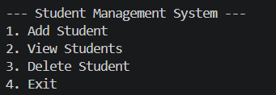
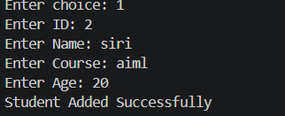
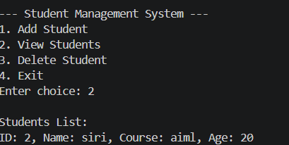
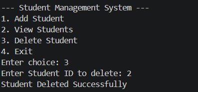

# Student Management System

## Project Overview

The Student Management System is a console-based application developed using C#. The project is designed to manage student records efficiently through basic CRUD operations such as adding, viewing, and deleting students.

This project demonstrates fundamental programming concepts including:

- Object-Oriented Programming (OOPS)
- Classes and Objects
- Lists and Collections
- Methods and Loops
- Conditional Statements
- User Input Handling

---

# Technologies Used

- C#
- .NET SDK
- Visual Studio Code
- Console Application

---

# Features

- Add Student
- View Students
- Delete Student
- Menu Driven Interface
- Simple User Interaction

---

# Project Structure

```text
StudentManagementSystem/
│
├── Program.cs
├── README.md
├── StudentManagementSystem.csproj
├── bin/
└── obj/
```

---

# How to Run the Project

## Step 1: Open Project Folder

Open the StudentManagementSystem folder in Visual Studio Code.

---

## Step 2: Open Terminal

Use the shortcut:

```text
Ctrl + `
```

Or go to:

```text
Terminal → New Terminal
```

---

## Step 3: Run the Project

Execute the following command in terminal:

```bash
dotnet run
```

---

# Sample Output

## Main Menu

```text
--- Student Management System ---
1. Add Student
2. View Students
3. Delete Student
4. Exit
```

### Screenshot

```md

```

---

## Add Student

```text
Enter ID: 2
Enter Name: Siri
Enter Course: AIML
Enter Age: 20
Student Added Successfully
```

### Screenshot

```md

```

---

## View Students

```text
Students List:
ID: 2, Name: Siri, Course: AIML, Age: 20
```

### Screenshot

```md

```

---

## Delete Student

```text
Enter Student ID to delete: 2
Student Deleted Successfully
```

### Screenshot

```md

```

---

# Concepts Used

- OOPS Concepts
- Classes and Objects
- Lists in C#
- CRUD Operations
- Loops
- Methods
- Conditional Statements
- Console Applications

---

# Skills Demonstrated

- Problem Solving
- C# Programming
- Data Handling Using Collections
- Application Logic Development
- Basic Software Development

---

# Resume Project Description

Developed a console-based Student Management System using C# implementing CRUD operations, OOPS concepts, and collection-based data handling.

---

# Future Enhancements

- Update Student Feature
- Search Student Feature
- Database Integration
- ASP.NET Core Web API
- Angular Frontend
- Login Authentication

---

# Author

## Gudipally Siri Reddy
